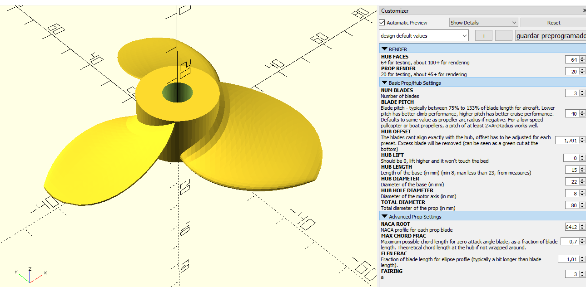

Prop generation
===============

Props are generated with a modified version of https://www.thingiverse.com/thing:5300828 (minor changes to easily generate props based on presets)

1. The default measures for the "big motor" have been added by default, but some values have to be adjusted depending on prop setting (like hub lenght/offsets when varying blade pitch).
2. Most relevant values have been parametrized to allow creating presets. Those are saved automatically on the committed .json file by OpenSCAD
3. I made a point to match the STL exactly with the current version of the preset+code. If any or both change, the .stl must be reuploaded to maintain consistency.